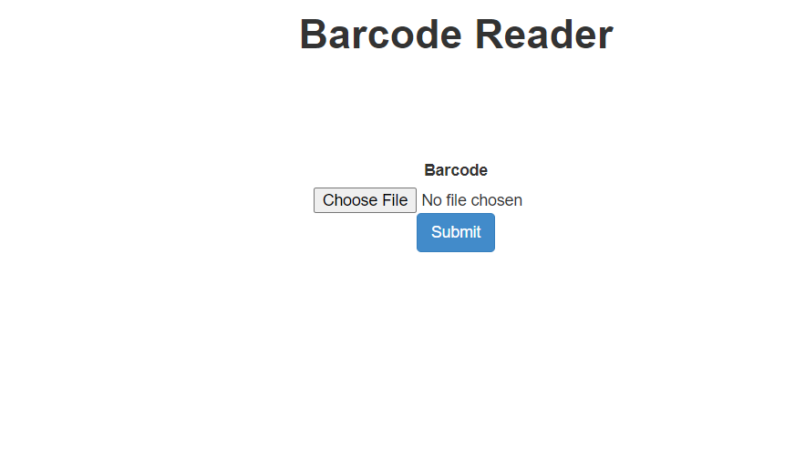

# BARCODE-READER

This is the link to our app: [Barcode reader](https://barcode-reader-opencv.herokuapp.com/).  
A barcode is a method of representing data in a visual, machine-readable form and can be scanned by special optical scanners. A bar code was initially one dimensional but later two dimensional barcodes were developed. A QR code (Quick Response code) is a type of matrix barcode or two-dimensional barcode. Barcodes are applied to products as a means of quick identification. They are used in retail stores as part of the purchase process, in warehouses to track inventory, and on invoices to assist in accounting, among many other uses.

The pyzbar and openCV libraries have been used in our program for detecting and decoding the barcode/ QR code images. The pyzbar library can read one-dimensional barcodes and QR codes using the zbar library. We have designed an app using flask and Heroku. The app takes in an image with a barcode and then decodes it. It then prints the output as the value or link present in the barcode/QR code. 
This is the first page of our app where the user can upload an image from his/her device. 
 
   
On pressing the 'Submit' button, a new page with the results of the barcode details are displayed. There is also an 'Upload another?' button to redirect to the first page for choosing another file.
 
In the output screen, our app shows both the images with the labelled text hidden inside the Code ( QR or Bar ), like the output shown below.

